# Bus reservation system 

## Functional requirements
> customer <
registration, login
adding information
filtering journeys
booking of journeys

> administrator <
login
adding, removing, modifying journeys

## Technologies used in the project
• Spring Boot 
• Spring Framework 
• Hibernate Framework 
• Tomcat 
• MySQL database 
• HTML, CSS, Bootstrap 
• Gradle 
• JUnit 

 

  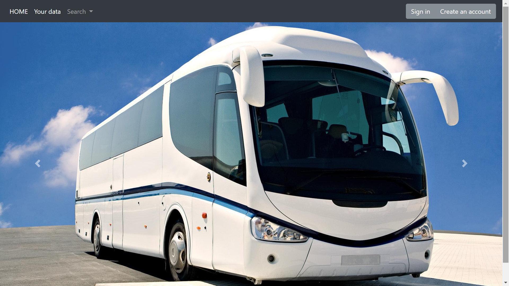
  
View - home page

  

  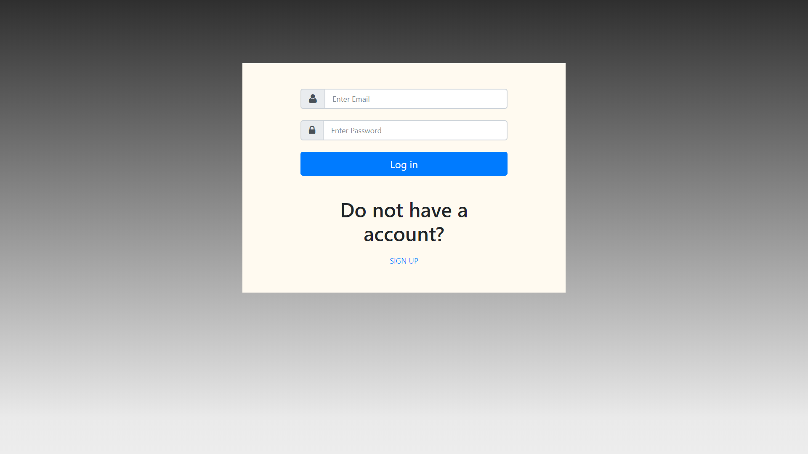
  
View - login page

  

  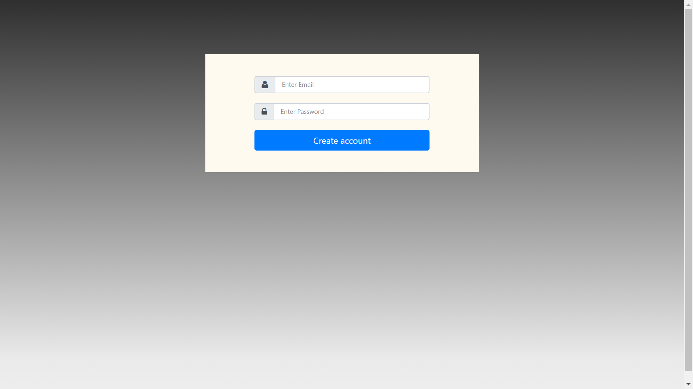
  
View - registration page

  

  
  
View - page after success login

  

  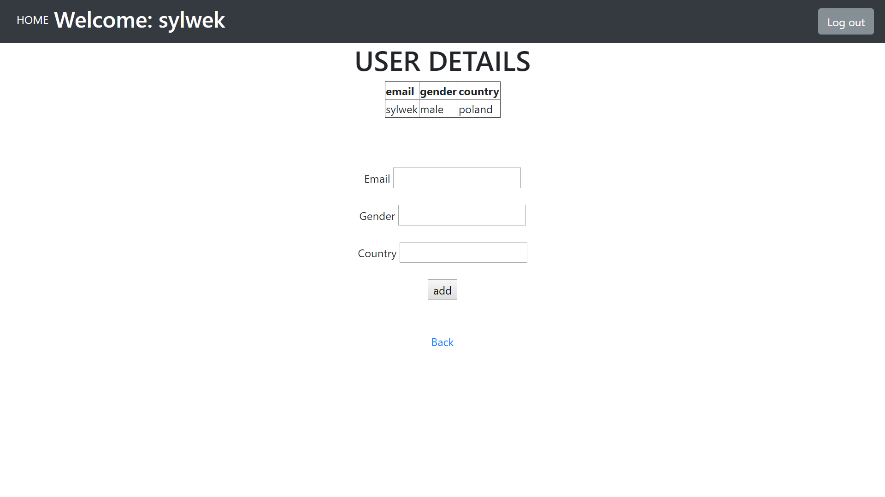
  
View - the user can add his data

  

  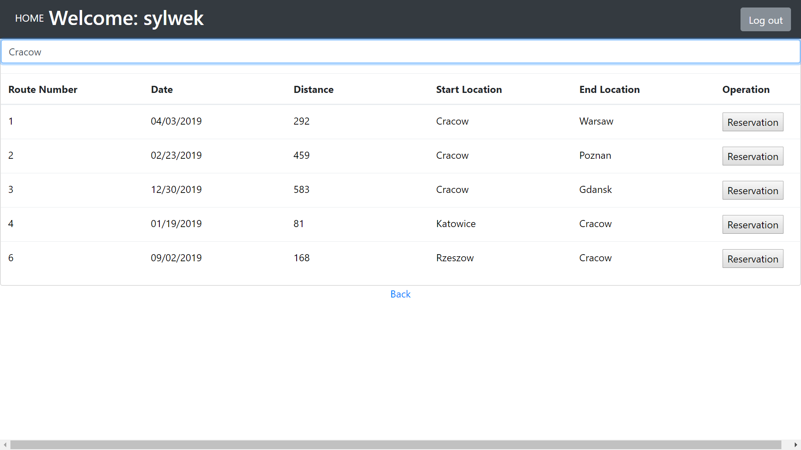
  
View - the user can filter and book a ride

  

  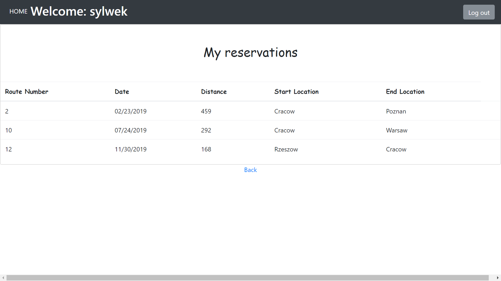
  
View - the user can see the booked journeys

  

  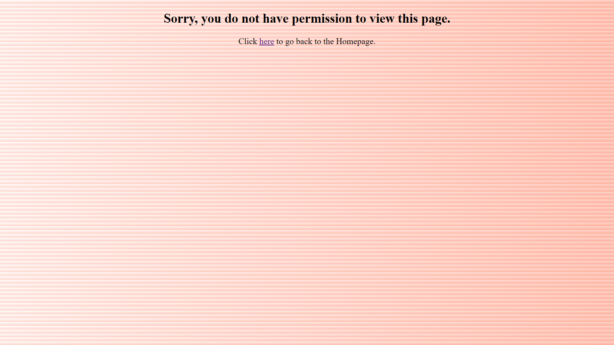
  
View - the user can not enter the admin panel

  

  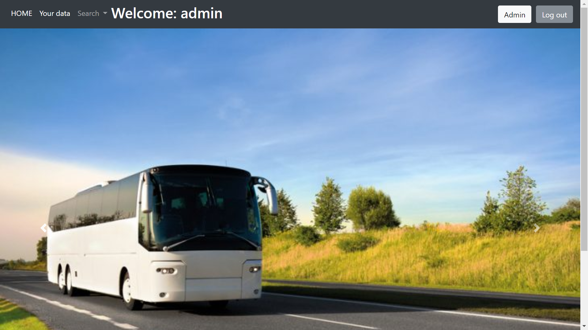
  
View - page after success login admin

  

  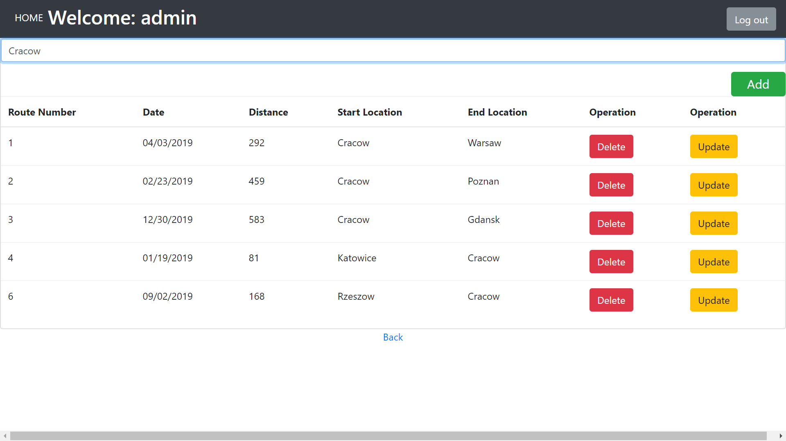
  
View - admin panel page

  

  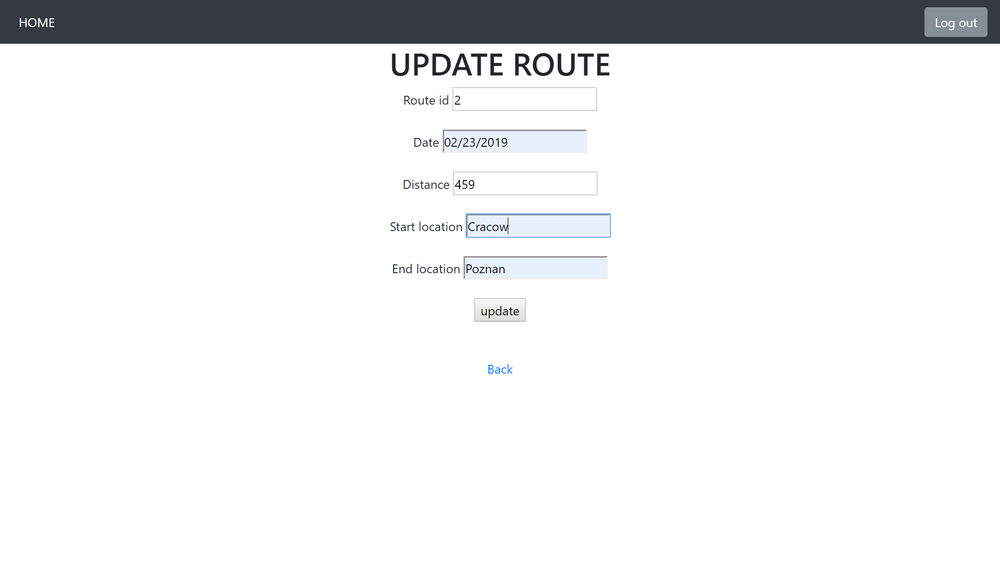
  
View - the administrator can update the trip

  

  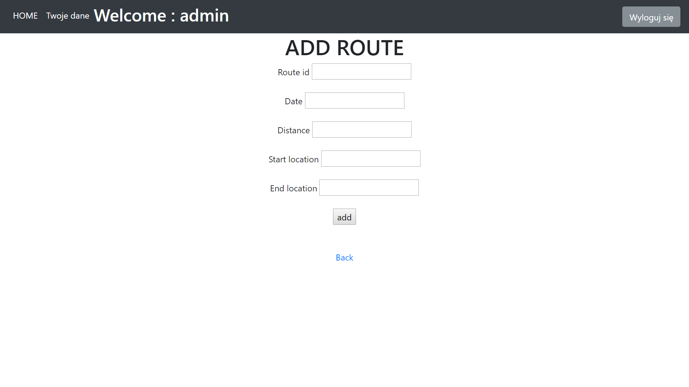
  
View - the administrator can add a new route

  

## How to run a project?
1.	Clone or download a project from github 
2.	Make sure you have the above tools installed (the correct versions can be found in the pom/gradle file)
3.	Open project in IntelliJ IDEA (an Ultimate version may be required)
4.	Run the project and have fun
